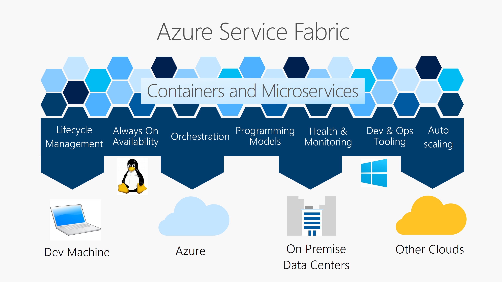

# Service Fabric Mesh

* Azure Service Fabric Mesh is a fully managed service that enables developers to deploy microservices applications without managing virtual machines, storage, or networking. 
* Supports any programming language or framework that can run in a container.

# Service Fabric

* Easy to package, deploy, and manage scalable and **Reliable microservices** and containers.
* Developers and administrators can avoid complex infrastructure problems and focus on implementing mission-critical, demanding workloads that are scalable, reliable, and manageable.

# Demo

# Visualization

# Single Point of Failure

# Database per service

# Service Fabric State

# Service Fabric State

# Any OS, any cloud

* Azure or on premises.
* Windows Server or Linux Server.
* Even create clusters on other public clouds.